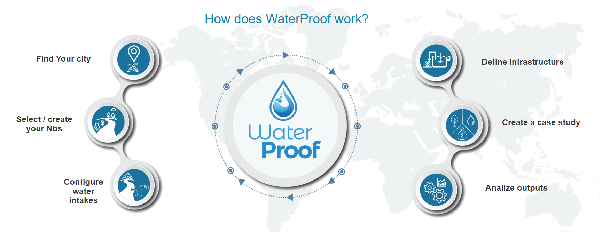
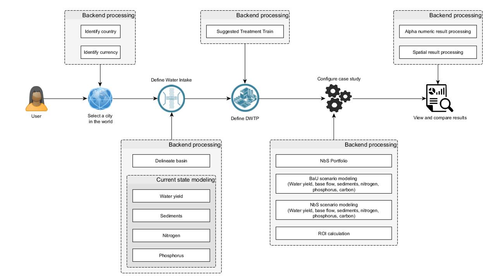
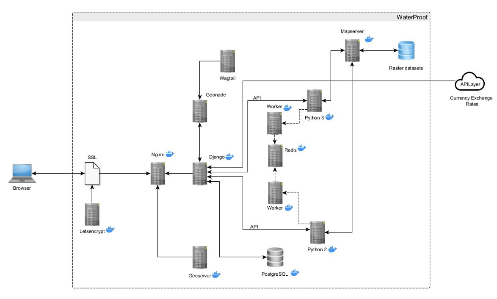

# WaterProof

WaterProof provides a rapid and indicative NbS investment portfolio and associated ROI. The tool is intended to engage stakeholders interested in exploring solutions to local water challenges and prioritization of locations for possible NbS water security programs (such as Water Funds).

WaterProof version 1.0 focusesd on ROI analysis for operation and maintenance of drinking water supply system infrastructure (including drinking water treatment plants - DWTP). This version uses global databases for modeling and analysis. In this first version, we used  Resource Investment Optimization System (RiOS) (Vogl et al., 2016) as software for analysis and generation of NbS portfolios, and Integrated Valuation of Ecosystem Services and Tradeoffs (InVEST)  (Sharp et al., 2016) as software for ecosystem services modeling. We also incorporated algorithms in WaterProof for financial analysis and economic valuation of benefits for ROI calculation .

## Steps to set up a case study and run the models
The application offers you a series of forms that allow you to:
* Indicate the location of the catchment or catchments that provide water to your city.
* Indicate the characteristics of your water intake system: types of connection, existence of reservoirs, external entrances, among others.
* Define the functions that determine how the operation and maintenance costs of the water system. calculated. If you don't have them, the system will use default values.
* The system will ask for estimated data on the water demand by each catchment.
* Indicate which processes and technologies are part of your treatment plant. Each technology has its cost function.
*Define the cost functions for operation and maintenance of the treatment plant. If you don't have them, the system will use default values.

  

- 📺 Full demo video: https://water-proof.org/pages/en/how-wp-work/

## Logic in execution and model calling
This diagram shows the processes running in the application backend, including calls to model services.

  

## Technical requirements
The diagram of components and their relationships are shown below:

  

* SSL Secure Sockets Layer is used to configure the HTTPS server to keep an Internet connection secure, as well as to protect any sensitive information that is sent.
* Nginx is the open source application server, in charge of hosting the WaterProof logic, handling user requests and arranging the different user interaction forms.
* Geonode is the open source geospatial content manager, developed in Python and whose web framework is Django. It is responsible for linking the different WaterProof query and information presentation modules (Corti et al., 2019).
* Django is a web application development framework under Python. It is open source and allows the rapid development of secure and maintainable websites. It is used by WaterProof to manage secure user accounts and invoke different processing required by the InVest and RiOS models (Django Software Foundation, 2019).
* Wagtail is a free content manager that articulates to Django to facilitate the creation of informative and user support web pages (Wagtail Team, 2020).
* Geoserver is an open source spatial data server, written in Java, that facilitates the management of geospatial data. It implements the Open Geospatial Consortium (OGC) guidelines, and with which WaterProof manages the global river layer. It allows managing Web Map Services (WMS), Web Feature Services (WFS) and Web Coverage Services (WCS) (GeoServer, 2015).
* RiOS Resource Investment Optimization System (Vogl et al., 2016) is associated with a set of libraries developed in Python 2 while InVEST (Sharp et al., 2016) corresponds to a set of libraries in Python 3. 
* Celery (Worker) and Redis are support containers that allow WaterProof to queue manage the execution of the models, so that while the user configures the case study, the system generates the data and geographic layers needed for the analysis. This asynchronous task management architecture works through Celery to distribute the work in threads (Celery Team, 2022).
* Mapserver is an open source application for publishing spatial data that WaterProof also uses within a Docker container to manage the raster layers generated in the execution of the models and display them in the reports section (MapServer Team, 2022).
* WaterProof uses the currency conversion service to query exchange rates for analysis through the use of APIs Application Programming Interfaces. Among them is APILayer which offers different types of services commonly used in application development (APILayer Team, 2022).
* PostgreSQL is an open source relational database manager, which is responsible for managing all the alphanumeric information needed to perform a case study. Through its PostGIS extension, it stores spatial data (PosgreSQL Team, 2022).

### DataBase
WaterProof has a data model on PostgreSQL. Click [here](https://tnc.box.com/s/lc6vee4f49fzur8lb4qwof9jd9ha63yi) to download a restore script.