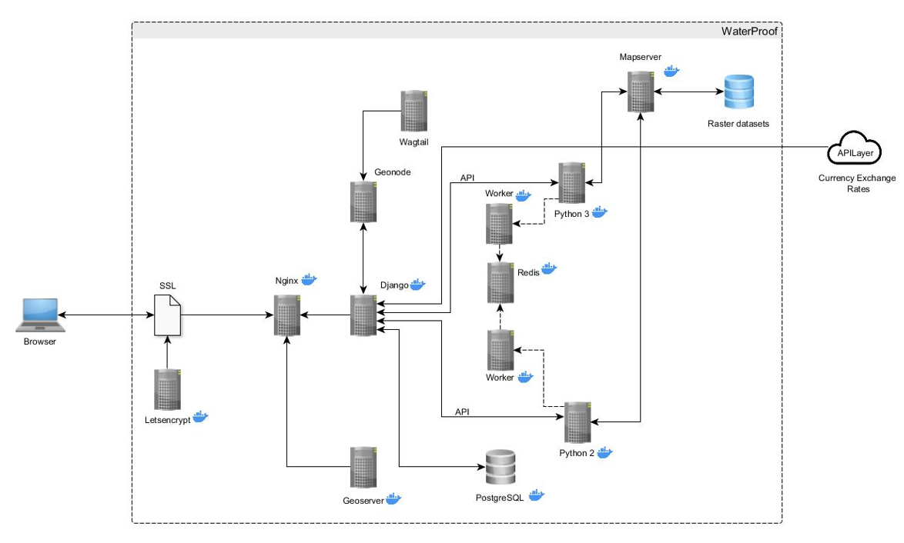

# WaterProof

WaterProof provides a rapid and indicative NbS investment portfolio and associated ROI. The tool is intended to engage stakeholders interested in exploring solutions to local water challenges and prioritization of locations for possible NbS water security programs (such as Water Funds).

WaterProof version 1.0 focusesd on ROI analysis for operation and maintenance of drinking water supply system infrastructure (including drinking water treatment plants - DWTP). This version uses global databases for modeling and analysis. In this first version, we used  Resource Investment Optimization System (RiOS) (Vogl et al., 2016) as software for analysis and generation of NbS portfolios, and Integrated Valuation of Ecosystem Services and Tradeoffs (InVEST)  (Sharp et al., 2016) as software for ecosystem services modeling. We also incorporated algorithms in WaterProof for financial analysis and economic valuation of benefits for ROI calculation .

## Steps to set up a case study and run the models
The application offers you a series of forms that allow you to:
* Indicate the location of the catchment or catchments that provide water to your city.
* Indicate the characteristics of your water intake system: types of connection, existence of reservoirs, external entrances, among others.
* Define the functions that determine how the operation and maintenance costs of the water system. calculated. If you don't have them, the system will use default values.
* The system will ask for estimated data on the water demand by each catchment.
* Indicate which processes and technologies are part of your treatment plant. Each technology has its cost function.
*Define the cost functions for operation and maintenance of the treatment plant. If you don't have them, the system will use default values.

  

- 📺 Full demo video: https://water-proof.org/pages/en/how-wp-work/

## Logic in execution and model calling
This diagram shows the processes running in the application backend, including calls to model services.

  

## Use of global databases
This table summarizes the global spatial databases that are used by WaterProof in its version 1.0. 

| Variable                             | Project                   | Pixel size   | Reference             |
|--------------------------------------|---------------------------|--------------|-----------------------|
| Digital Elevation Model	             | HydroSHEDS                | 1 Km         | (Lehner et al., 2008) | 
| Precipitation	                       | WorldClim                 | 1 Km         | (Fick & Hijmans, 2017)| 
| Rainy days                           | GPCC                      | 1 Km         | (Becker et al., 2013) | 
| Solar Radiation                      | WorldClim                 | 1 Km         | (Fick & Hijmans, 2017)| 
| Wind Speed                           | WorldClim                 | 1 Km         |(Fick & Hijmans, 2017) | 
|Water Vapor Pressure (kPa)            | WorldClim                 | 1 Km         | (Fick & Hijmans, 2017)| 
|Reference Evapotranspiration	         |TerraClimate	             |4 Km	        |(Abatzoglou et al., 2018)|
|Land use/land cover - Historic	       |ESA-CCI	                   |300 m	        |(Land Cover CCI Partnership, 2017)|
|Soil Group	                           |HYSOGs250m	               |250 m	        |(Ross et al., 2018)    |
|Curve Number	                         |GCN250	                   |250 m	        |(Jaafar et al., 2019)|
|Root Restricting Layer Depth	         |SoilGrids250m	             |250 m	        |(Hengl et al., 2017)|
|Catchments/Basin	                     |HydroSHEDS	               |-	            |(Lehner et al., 2008)|
|River Network	                       |HydroSHEDS	               |-	            |(Lehner et al., 2008)|
|Rainfall Erosivity	                   |ESDAC	                     |1 Km	        |(Panagos et al., 2017)|
|Sand Content	                         |SoilGrids250m	             |250 m	        |(Hengl et al., 2017)|
|Silt Content	                         |SoilGrids250m	             |250 m         |	(Hengl et al., 2017)|
|Clay Content	                         |SoilGrids250m	             |250 m	        |(Hengl et al., 2017)|
|Soil Organic Carbon Content	         |SoilGrids250m	             |250 m	        |(Hengl et al., 2017)|
|Aqueduct Global Databases	           |Aqueduct	                 |-	            |(Gassert et al., 2014)|
|Precipitation BCC-CSM2-MR	           |WorldClim	                 |1 Km	        |(Swart et al., 2019)|
|Precipitation  CNRM-ESM2-1	           |WorldClim	                 |1 Km	        |(Swart et al., 2019)|
|Precipitation MIROC6	                 |WorldClim	                 |1 Km	        |(Swart et al., 2019)|
|Maximum Temperature BCC-CSM2-MR	     |WorldClim	                 |1 Km	        |(Swart et al., 2019)|
|Minimum Temperature BCC-CSM2-MR	     |WorldClim	                 |1 Km          |(Swart et al., 2019)|
|Maximum Temperature CNRM-ESM2-1	     |WorldClim	                 |1 Km	        |(Swart et al., 2019)|
|Minimum Temperature CNRM-ESM2-1	     |WorldClim	                 |1 Km	        |(Swart et al., 2019)|
|Maximum Temperature MIROC6	           |WorldClim	                 |1 Km	        |(Swart et al., 2019)|
|Minimum Temperature MIROC6	           |WorldClim	                 |1 Km	        |(Swart et al., 2019)|

## Technical requirements
The diagram of components and their relationships are shown below:

  

* SSL and Letsencript, used to configure the HTTPS server and allow to automatically obtain a certificate trusted by the browser, without any human intervention, which lightens administration activities (Aas et al., 2019).
* Nginx is the open-source web server selected for its low memory usage and high concurrency characteristics. It is in charge of hosting the WaterProof logic and providing the user with the contents and interaction forms. It operates under an advanced event-based architecture (EBA), which allows it to serve numerous simultaneous connections, at higher speed and scalability (Reese, 2008).
* Geonode is the geospatial content manager, free software, developed in Python and whose web framework is Django. It is responsible for linking the different WaterProof query and information presentation modules (Corti et al., 2019).
* Django is a high-level web framework, free and open source, which allows the rapid development of secure and maintainable websites. It is used by WaterProof to manage secure user accounts and invoke different processing required by InVest and RiOS models (Django Software Foundation, 2019).
* Wagtail is a free and open-source content manager written in Python, which is used by WaterProof to create the informative and user support web pages (Wagtail Team, 2020).
* Geoserver is an open-source spatial data server, written in Java, which facilitates the management of geospatial data. It is an application that not only implements the open web standard protocols established by the Open Geospatial Consortium (OGC) but is also a high-performance server compatible with the Web Map Service (WMS) certification, and it is the reference implementation of the OGC Web Feature Service (WFS) and Web Coverage Service (WCS) standards. In WaterProof, Geoserver is responsible for arranging the world's river layer and helping the user to locate the basin of interest (GeoServer, 2015).
* RiOS  (Vogl et al., 2016) is associated with a set of libraries developed in Python 2 while InVEST (Sharp et al., 2016) corresponds to a series of libraries in Python 3. 
* Celery (Worker) and Redis are support containers that allow WaterProof to arrange background tasks for the execution of the models, so that while the user is configuring the case study, the system generates data and geographic layers required for the analysis. This asynchronous task management architecture works through Celery to distribute the work in threads. For Celery to work, it requires a broker or intermediary (Redis) in charge of reporting the progress of the tasks (Celery Team, 2022).
* Mapserver is an open-source application to publish spatial data that WaterProof also uses within a Docker container to manage the raster layers generated in the execution of the models and display them in the reports section (MapServer Team, 2022).
* APILayer is a platform that offers different types of services commonly used in application development. WaterProof uses the currency conversion service to consult the currency exchange rates for the analysis (APILayer Team, 2022).
* PostgreSQL is an open-source relational database manager, which is responsible for managing all the alphanumeric information required to run a case study. Through its PostGIS extension, it stores spatial data (PosgreSQL Team, 2022).

### DataBase
WaterProof has a data model on PostgreSQL. Click [here](https://tnc.box.com/s/lc6vee4f49fzur8lb4qwof9jd9ha63yi) to download a restore script.

