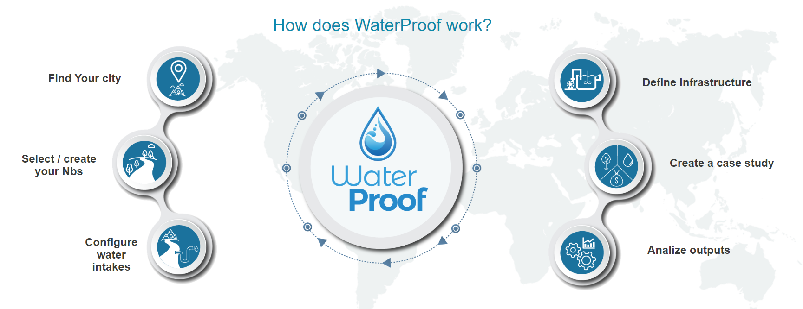
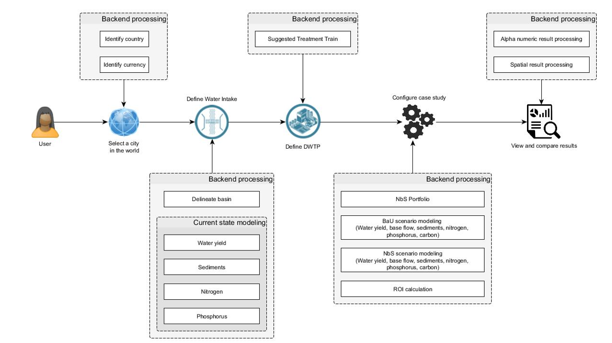

# WaterProof

WaterProof provides a rapid and indicative NbS investment portfolio and associated ROI. The tool is intended to engage stakeholders interested in exploring solutions to local water challenges and prioritization of locations for possible NbS water security programs (such as Water Funds).

WaterProof version 1.0 focusesd on ROI analysis for operation and maintenance of drinking water supply system infrastructure (including drinking water treatment plants - DWTP). This version uses global databases for modeling and analysis. In this first version, we used  Resource Investment Optimization System (RiOS) (Vogl et al., 2016) as software for analysis and generation of NbS portfolios, and Integrated Valuation of Ecosystem Services and Tradeoffs (InVEST)  (Sharp et al., 2016) as software for ecosystem services modeling. We also incorporated algorithms in WaterProof for financial analysis and economic valuation of benefits for ROI calculation .

## Steps to set up a case study and run the models
The application offers you a series of forms that allow you to:
* Indicate the location of the catchment or catchments that provide water to your city.
* Indicate the characteristics of your water intake system: types of connection, existence of reservoirs, external entrances, among others.
* Define the functions that determine how the operation and maintenance costs of the water system. calculated. If you don't have them, the system will use default values.
* The system will ask for estimated data on the water demand by each catchment.
* Indicate which processes and technologies are part of your treatment plant. Each technology has its cost function.
*Define the cost functions for operation and maintenance of the treatment plant. If you don't have them, the system will use default values.

  

## Logic in execution and model calling
This diagram shows the processes running in the application backend, including calls to model services.

  

## Use of global databases
This table summarizes the global spatial databases that are used by WaterProof in its version 1.0. 

| Variable                             | Project                   | Pixel size   | Reference             |
|--------------------------------------|---------------------------|--------------|-----------------------|
| Digital Elevation Model	             | HydroSHEDS                | 1 Km         | (Lehner et al., 2008) | 
| Precipitation	                       | WorldClim                 | 1 Km         | (Fick & Hijmans, 2017)| 
| Rainy days                           | GPCC                      | 1 Km         | (Becker et al., 2013) | 
| Solar Radiation                      | WorldClim                 | 1 Km         | (Fick & Hijmans, 2017)| 
| Wind Speed                           | WorldClim                 | 1 Km         |(Fick & Hijmans, 2017) | 
|Water Vapor Pressure (kPa)            | WorldClim                 | 1 Km         | (Fick & Hijmans, 2017)| 
|Reference Evapotranspiration	         |TerraClimate	             |4 Km	        |(Abatzoglou et al., 2018)|
|Land use/land cover - Historic	       |ESA-CCI	                   |300 m	        |(Land Cover CCI Partnership, 2017)|
|Soil Group	                           |HYSOGs250m	               |250 m	        |(Ross et al., 2018)    |
|Curve Number	                         |GCN250	                   |250 m	        |(Jaafar et al., 2019)|
|Root Restricting Layer Depth	         |SoilGrids250m	             |250 m	        |(Hengl et al., 2017)|
|Catchments/Basin	                     |HydroSHEDS	               |-	            |(Lehner et al., 2008)|
|River Network	                       |HydroSHEDS	               |-	            |(Lehner et al., 2008)|
|Rainfall Erosivity	                   |ESDAC	                     |1 Km	        |(Panagos et al., 2017)|
|Sand Content	                         |SoilGrids250m	             |250 m	        |(Hengl et al., 2017)|
|Silt Content	                         |SoilGrids250m	             |250 m         |	(Hengl et al., 2017)|
|Clay Content	                         |SoilGrids250m	             |250 m	        |(Hengl et al., 2017)|
|Soil Organic Carbon Content	         |SoilGrids250m	             |250 m	        |(Hengl et al., 2017)|
|Aqueduct Global Databases	           |Aqueduct	                 |-	            |(Gassert et al., 2014)|
|Precipitation BCC-CSM2-MR	           |WorldClim	                 |1 Km	        |(Swart et al., 2019)|
|Precipitation  CNRM-ESM2-1	           |WorldClim	                 |1 Km	        |(Swart et al., 2019)|
|Precipitation MIROC6	                 |WorldClim	                 |1 Km	        |(Swart et al., 2019)|
|Maximum Temperature BCC-CSM2-MR	     |WorldClim	                 |1 Km	        |(Swart et al., 2019)|
|Minimum Temperature BCC-CSM2-MR	     |WorldClim	                 |1 Km          |(Swart et al., 2019)|
|Maximum Temperature CNRM-ESM2-1	     |WorldClim	                 |1 Km	        |(Swart et al., 2019)|
|Minimum Temperature CNRM-ESM2-1	     |WorldClim	                 |1 Km	        |(Swart et al., 2019)|
|Maximum Temperature MIROC6	           |WorldClim	                 |1 Km	        |(Swart et al., 2019)|
|Minimum Temperature MIROC6	           |WorldClim	                 |1 Km	        |(Swart et al., 2019)|

## Technical requirements

